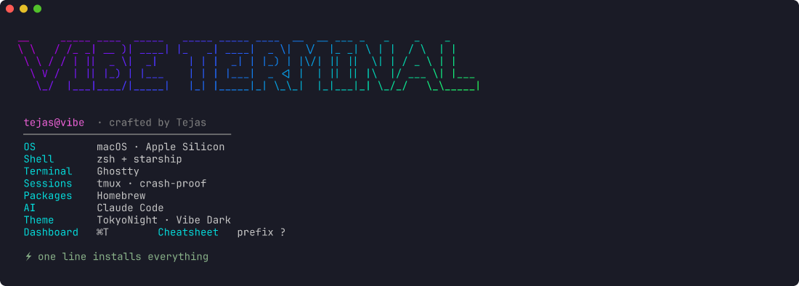
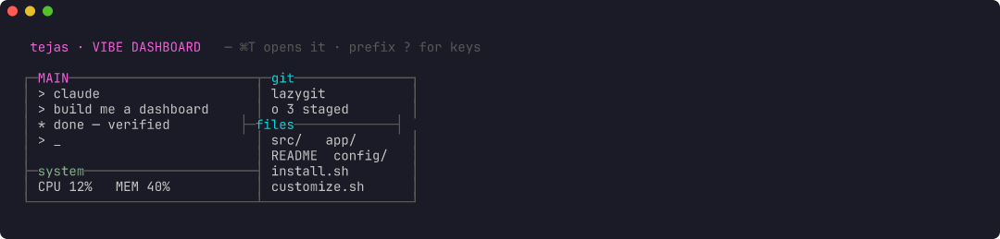
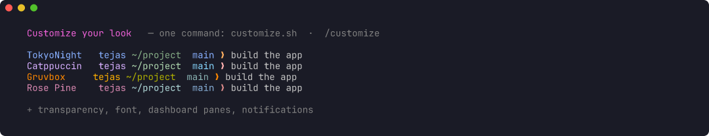
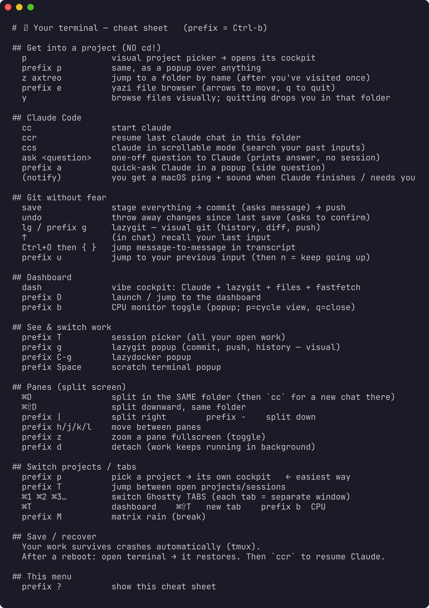

<div align="center">


### A beautiful, crash-proof macOS terminal. **One line installs everything.** ⚡

<p>
<a href="https://tejas-codex.github.io/vibe-terminal/"></a>
<a href="#-install"></a>
<a href="https://github.com/tejas-codex/vibe-terminal/stargazers"></a>
<a href="https://github.com/tejas-codex"></a>
</p>

<p>


</p>

<br/>



</div>

## ⚡ Install

<div align="center">

**Paste this one line. It installs Homebrew + the Ghostty app + every tool + all configs, then opens the dashboard.**

</div>

```bash
curl -fsSL https://raw.githubusercontent.com/tejas-codex/vibe-terminal/main/bootstrap.sh | bash
```

<details>
<summary>Prefer to clone first?</summary>

```bash
git clone https://github.com/tejas-codex/vibe-terminal.git ~/dotfiles-vibe
cd ~/dotfiles-vibe && ./install.sh
```
</details>

> Only requirement: a **Mac** (Apple Silicon). Existing files are backed up (`.bak-*`). The installer is idempotent — re-run anytime.

## 🤖 …or just tell your AI agent

Don't want to touch the terminal? Paste this into **Claude Code, Cursor, or any AI CLI** — it does the whole install for you:

```text
Set up the Vibe Terminal from https://github.com/tejas-codex/vibe-terminal —
run its installer:  curl -fsSL https://raw.githubusercontent.com/tejas-codex/vibe-terminal/main/bootstrap.sh | bash
Then read CLAUDE.md and offer to run /customize.
```

## 🧩 What you're installing

| | Tool | What it does |
|---|---|---|
| 🖥️ | **[Ghostty](https://ghostty.org/)** | the terminal app — fast, GPU-accelerated, native (the installer grabs it for you) |
| 🛟 | **tmux** | keeps your work + Claude alive through crashes, restarts, reboots |
| ⌨️ | **zsh + starship** | smart, good-looking shell — suggestions, fuzzy history, smart jump |
| 🤖 | **Claude Code** | Anthropic's AI coding CLI — this setup is tuned around it |

## ✨ Why it feels great

<table>
<tr>
<td width="33%" valign="top"><h3>🚀 One-line install</h3>Homebrew, Ghostty, every CLI tool & all configs — done in minutes.</td>
<td width="33%" valign="top"><h3>🛟 Crash-proof</h3>tmux keeps your sessions (and Claude) alive through anything.</td>
<td width="33%" valign="top"><h3>🎛️ Pilot dashboard</h3>⌘T → Claude + lazygit + files + system, auto-laid-out.</td>
</tr>
<tr>
<td valign="top"><h3>⌨️ Warp-parity shell</h3>Inline suggestions, fuzzy history (atuin), zoxide, starship.</td>
<td valign="top"><h3>🤖 Tuned for Claude</h3>Highlighted messages, desktop pings, resume, ⌘V fix, word-jump.</td>
<td valign="top"><h3>🎨 Yours in seconds</h3><code>customize.sh</code> or <code>/customize</code> — theme, transparency, font.</td>
</tr>
</table>

## 🖼️ Looks

<div align="center">

<b>The dashboard — <code>⌘T</code></b>


<br/><br/>

<b>Make it your style — <code>customize.sh</code></b>


</div>

## ⌨️ Key bindings

<div align="center">

| Key | Action | | Key | Action |
|---|---|---|---|---|
| `⌘T` | open the dashboard | | `prefix g` | lazygit (visual git) |
| `⌘D` / `⌘⇧D` | split — **same folder** | | `prefix e` | yazi file browser |
| `⌥ ← / →` | jump by word | | `prefix b` | CPU monitor |
| `prefix p` | project picker | | `save` / `undo` | git without fear |
| `prefix T` | switch sessions | | `cc` / `ccr` | claude / resume chat |

*prefix = `Ctrl-b` · forgot one? press `Ctrl-b ?` for the live cheat sheet*



</div>

## 🎨 Make it yours

```bash
~/dotfiles-vibe/customize.sh          # gum menu: theme · transparency · highlight · font
```
Or, with Claude Code: `cd ~/dotfiles-vibe && claude` → `/customize`.

## 🔁 Get started in 3 steps

<table>
<tr>
<td width="33%" valign="top"><h3>1️⃣ Paste the line</h3>Run the install command in any terminal.</td>
<td width="33%" valign="top"><h3>2️⃣ Ghostty opens</h3>You land in the dashboard — Claude, git, files, system.</td>
<td width="33%" valign="top"><h3>3️⃣ Make it yours</h3>Run <code>customize.sh</code> to tune the look.</td>
</tr>
</table>

## 🔄 Sync across machines

After tweaking on any machine:
```bash
cd ~/dotfiles-vibe && ./sync.sh && git add -A && git commit -m "update" && git push
```
Other machines: `git pull && ./install.sh`.

## 📁 Repo layout
`install.sh` `bootstrap.sh` `sync.sh` `customize.sh` `record-demo.sh` · `Brewfile` · `CLAUDE.md` (agent context) · `.claude/commands/` (slash commands) · `config/` (all dotfiles) · `docs/` (the website).

<div align="center">

<br/>

[](https://github.com/tejas-codex/vibe-terminal)
[](https://tejas-codex.github.io/vibe-terminal/)

Built with [Ghostty](https://ghostty.org/) · [tmux](https://github.com/tmux/tmux) · [Claude Code](https://www.anthropic.com/claude-code) — open source, MIT.


</div>
